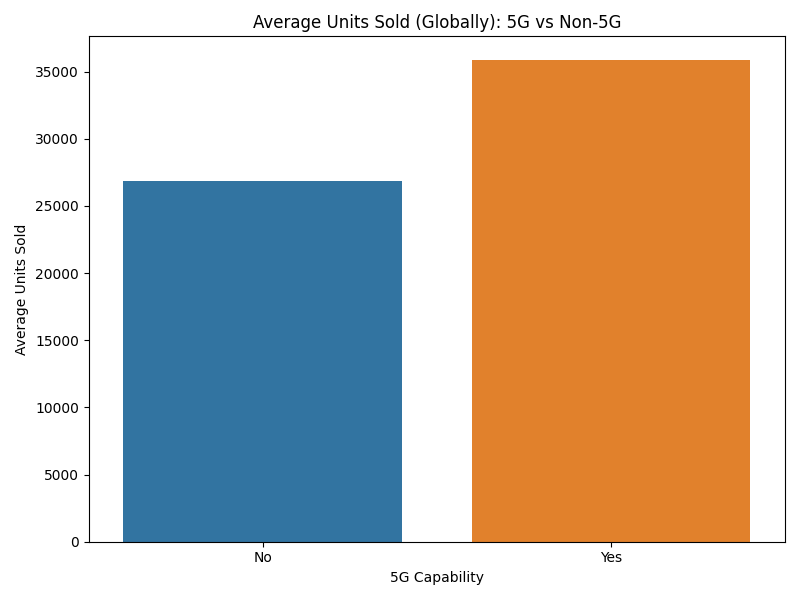
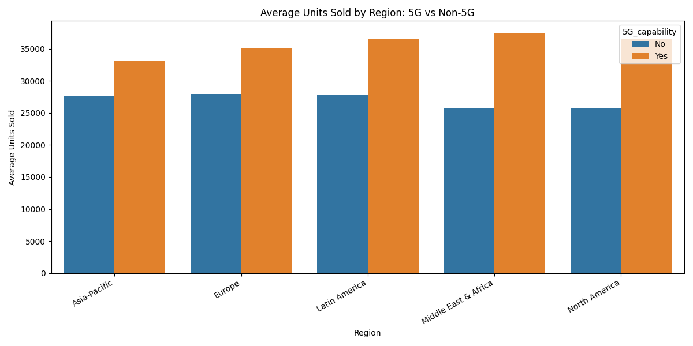
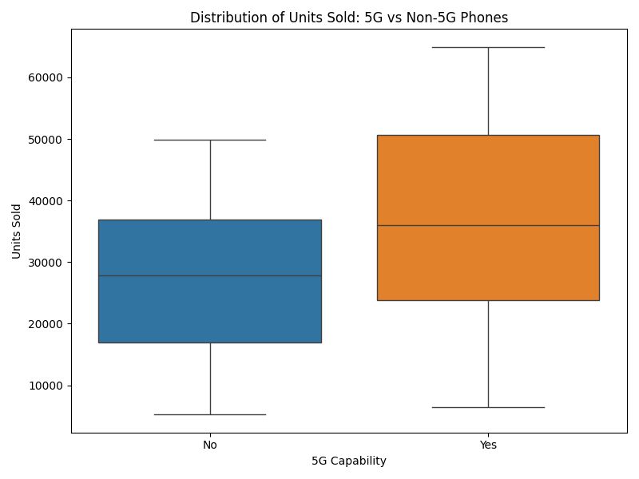

# Samsung 5G Smartphone Sales Analysis

Exploratory Data Analysis of Samsung Galaxy smartphone sales to determine whether 5G capability is associated with higher unit sales across global regions.

## Research Question
Do Samsung Galaxy smartphones with 5G capability sell more units than non-5G models?

## Dataset
Source: Kaggle Samsung Mobile Sales Dataset

Key variables:
- Product model
- Region
- Units sold
- 5G capability
- Regional 5G coverage
- Revenue

## Key Findings

- 5G smartphones sold **33% more units on average** than non-5G devices.
- The sales advantage appears across **all regions**.
- Median sales for 5G devices are consistently higher.

## Visualizations

### Global Comparison

### Regional Comparison

### Distribution of Sales

## Tools Used
- Python
- Pandas
- Matplotlib
- Seaborn
